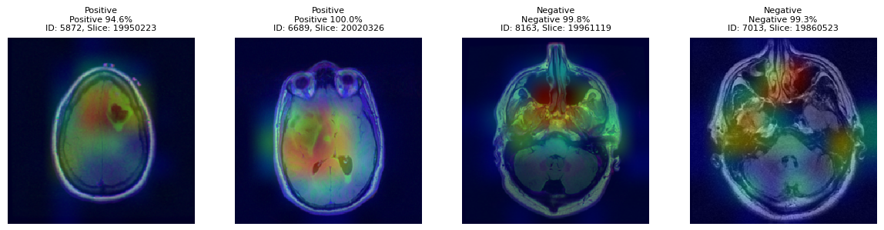
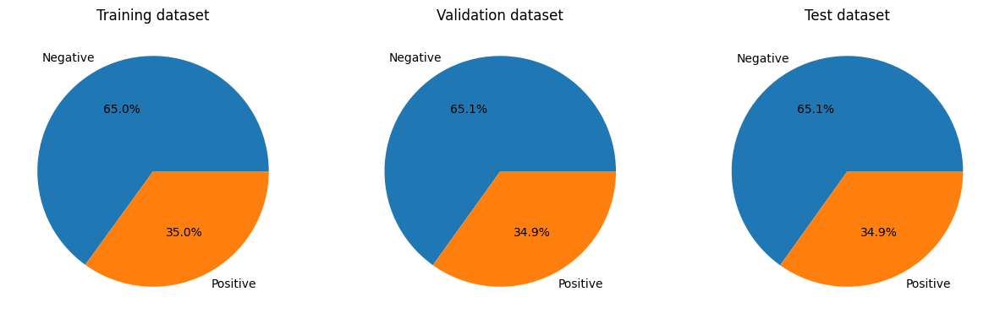
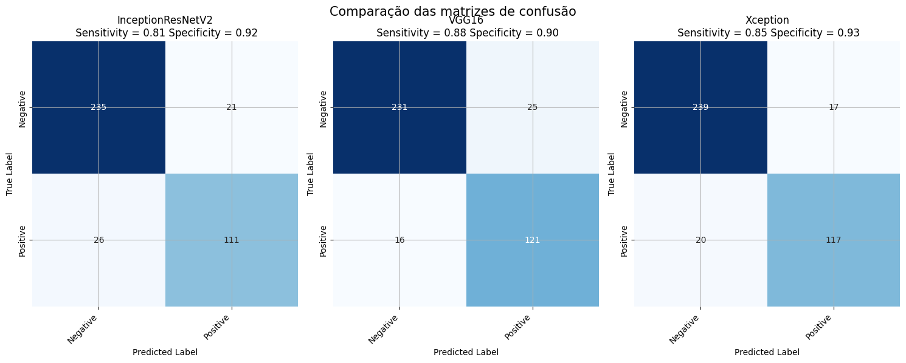
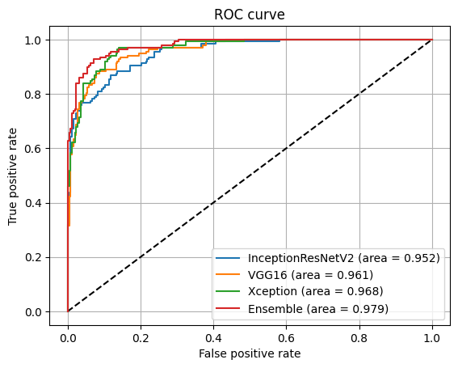

# Automated Brain Tumor Detection in MRI

Deep learning system for classifying brain tumors in MRI scans, using fine-tuned CNNs, ensemble learning, and Explainable AI (Grad-CAM) to show *why* the model makes each prediction, not just the prediction itself.

  
   
  Grad-CAM heatmaps over test scans. Red regions are what the model focused on to reach its decision.

## 📋 Overview

Early and accurate detection of brain tumors is critical for clinical decision support and treatment planning. This project fine-tunes three pre-trained CNN architectures and combines them through ensemble learning to maximize accuracy and generalization, while using Grad-CAM to keep the predictions interpretable rather than a black box.

## 🚀 Methodology

- **Dataset**: [LGG MRI Segmentation](https://www.kaggle.com/datasets/mateuszbuda/lgg-mri-segmentation) (Mateusz Buda), via Kaggle.
- **Architectures**: VGG16, Xception, and InceptionResNetV2, each fine-tuned on the dataset.
- **Preprocessing**: normalization, data augmentation, and class balancing.
- **Split**: 70% training, 20% validation, 10% test.
- **Ensemble**: arithmetic mean voting across the three fine-tuned models.
- **Interpretability**: Grad-CAM to visualize which regions of each scan drove the model's decision.

  

## 📊 Results

| Model | Accuracy | Recall | F1-Score | AUC |
|---|---|---|---|---|
| InceptionResNetV2 | 0.88 | 0.86 | 0.87 | 0.952 |
| VGG16 | 0.90 | 0.89 | 0.89 | 0.961 |
| Xception | 0.91 | 0.89 | 0.90 | 0.968 |
| **Ensemble (Final)** | **0.93** | **0.92** | **0.92** | **0.979** |

*Results on the held-out test set, after fine-tuning.*

  

  

## 🧠 Explainability (XAI)

Accuracy alone isn't enough for a clinical use case, a model can be right for the wrong reasons. Grad-CAM generates a heatmap over each scan showing which pixels most influenced the prediction, so the highlighted regions can be checked against the actual tumor location. This is what the top image in this README shows.

## 🛠️ Tech Stack

  

  
  
  
  

## ▶️ Usage

1. Clone the repository.
2. Install dependencies: `pip install -r requirements.txt`.
3. The notebook downloads the dataset automatically via `kagglehub`.
4. Run `brain_tumor_detection.ipynb`.

## 📄 Full Report

For the complete methodology, architecture choices, and results: [Read the full report (PDF)](Automated_Detection_of_Brain_Tumors_in_Magnetic_Resonance_Imaging__MRI__through_Convolutional_Neural_Networks_and_Ensemble_Learning.pdf)

## 📜 License

MIT License, see [LICENSE](LICENSE).

## 👤 About

Part of my portfolio. See my [GitHub profile](https://github.com/linho22w) for more projects in AI/ML and backend development.
